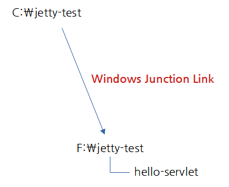

# Unable to Read Static Resource Files Located Under the Webapp Path in Jetty12 (EE8)


Hello,

I have been effectively using the `jetty-maven-plugin` for creating web example projects.

However, I encountered an issue when I upgraded from Jetty 10 to 12. I received a 404 response when trying to read static resource files (html, png…) located under `/src/main/webapp`. Hence, I am writing this question post.


## Example Project

### [hello-servlet](hello-servlet) Simple Servlet Web Project

#### Running with Jetty 10

```sh
mvn clean jetty:run -Pjetty10
```

When running with Jetty 10, there is no problem accessing the following paths:

- `http://localhost:8080/index.html`
- `http://localhost:8080/resources/images/smile.png`


#### Running with Jetty 12

```sh
mvn clean jetty:run
```

In Jetty 12, I receive a 404 response when trying to access `index.html` and `smile.png`.

Is there something more I need to set up to access static resource files under webapp path?

---

✨ However, I have learned more since then.

My directory execution environment is as follows. (Windows 10)



It seems that when running `Jetty 12` from the `C:\jetty-test\hello-servlet` path via Junction Link, it cannot read static resources.

There was no problem when running from the original location, `F:\jetty-test\hello-servlet`, from the beginning.

In Jetty 10, it was able to find resources well even in the Junction Link environment. I’m not sure why it can’t find them in Jetty 12.

I have made an inquiry regarding this.


Thank you. Have a nice day 👍


---

# Jetty12 (EE8)에서 webapp경로 이하의 정적 리소스 파일을 읽을 수 없음


안녕하세요.

그동안 `jetty-maven-plugin`을  웹 예제 프로젝트 작성에 아주 잘 사용해왔습니다.

이번에 Jetty 10에서 12 버전으로 업그레이드 했을 때..

`/src/main/webapp` 이하의 정적 리소스 파일(html, png...)을 읽으려고 하면 404 응답을 받아서 질문 글을 작성하였습니다.


## 예제 프로젝트

### [hello-servlet](hello-servlet) 단순 서블릿 프로젝트

#### Jetty 10 실행

```sh
mvn clean jetty:run -Pjetty10
```

Jetty 10으로 실행할 때는 다음 경로 접근에 문제가 없음

* `http://localhost:8080/index.html`
* `http://localhost:8080/resources/images/smile.png`


#### Jetty 12 실행

```sh
mvn clean jetty:run
```

Jetty 12에서는 index.html, smile.png에 접근하려하면 404 응답을 받음.

정적 리소스 파일들 읽기 위해서, 제가 무언가 더 설정해줘야할 것이 있을까요?

---

✨ 그런데 이후에 더 알게 된 점이 있습니다.

저의 디렉토리 실행 환경은 다음과 같은 상태입니다. (Windows 10)


아마도 정션 링크를 통한 `C:\jetty-test\hello-servlet` 경로에서 `Jetty 12`를 실행시키면 정적 리소스를 못 읽는 현상 같습니다.

처음 부터 원본 위치인 `F:\jetty-test\hello-servlet`에서 실행을 하면 문제가 없었구요..


Jetty 10에서는 Junction Link 환경에서도 리소스 잘 찾았었는데.. Jetty 12에서는 왜 못찾는지 모르겠습니다.

이와 관련해서 문의드렸습니다.


감사합니다. 좋은하루되세요 👍
