# React Router DOM 튜토리얼 따라하기

> * https://reactrouter.com/en/main/start/tutorial


## 튜토리얼

튜토리얼에 오신 것을 환영합니다! 연락처를 추적할 수 있는 작지만 기능이 풍부한 앱을 만들어 보겠습니다. 이 과정을 따라가다 보면 30~60분 정도 소요될 것으로 예상됩니다.


**👉 이 표시가 나타날 때마다 앱에서 무언가를 해야 한다는 뜻입니다!**

나머지는 정보 제공과 이해를 돕기 위한 것입니다. 그럼 시작해 보겠습니다.


### 설치

> 🎈 알림
>
> 여러분의 자체 앱에서 따라하지 않을 경우 이 섹션을 건너뛸 수 있습니다.

이 튜토리얼에서는 번들러와 개발 서버로 [Vite](https://vitejs.dev/guide/)를 사용하겠습니다. npm 명령줄 도구를 사용하려면 [Node.js](https://nodejs.org/)가 설치되어 있어야 합니다.

**👉️ 터미널을 열고 Vite로 새 React 앱을 부트스트랩하세요:**

```sh
> npm create vite@latest name-of-your-project -- --template react
Need to install the following packages:
  create-vite@4.3.0
Ok to proceed? (y) y
...
> cd my-tutorial-app
> npm install react-router-dom localforage match-sorter sort-by
> npm run dev
```

터미널에 인쇄된 URL을 방문할 수 있어야 합니다:

```
VITE v4.3.1  ready in 3083 ms

  ➜  Local:   http://localhost:5173/
  ➜  Network: use --host to expose
  ➜  press h to show help
```

> ✨ **주의사항**
>
> 윈도우의 정션링크로 연관된 경로에서 반드시 실제경로 문자만 인식하기 때문에, 실제 경로에 가서 실행해야한다.

이 튜토리얼을 위해 미리 작성된 CSS가 있으므로 React 라우터에 집중할 수 있습니다. 가혹하게 평가하거나 직접 작성해 보세요 😅 (이 튜토리얼의 마크업을 가능한 한 최소한으로 유지하기 위해 일반적으로 CSS에서 하지 않는 작업을 수행했습니다.)

**👉 [여기에 있는](https://gist.githubusercontent.com/ryanflorence/ba20d473ef59e1965543fa013ae4163f/raw/499707f25a5690d490c7b3d54c65c65eb895930c/react-router-6.4-tutorial-css.css) 튜토리얼 CSS를 src/index.css에 복사/붙여넣기합니다.**

이 튜토리얼에서는 데이터 생성, 읽기, 검색, 업데이트, 삭제에 대해 알아봅니다. 일반적인 웹 앱이라면 웹 서버의 API와 통신하겠지만, 여기서는 브라우저 저장소를 사용하고 네트워크 지연 시간을 속이려고 합니다. 이 코드 중 어느 것도 React Router와 관련이 없으므로 모두 복사/붙여넣기만 하면 됩니다.

**👉 [여기에 있는](https://gist.githubusercontent.com/ryanflorence/1e7f5d3344c0db4a8394292c157cd305/raw/f7ff21e9ae7ffd55bfaaaf320e09c6a08a8a6611/contacts.js) 튜토리얼 데이터 모듈을 src/contacts.js에 복사/붙여넣기합니다.**

src 폴더에 필요한 것은 contacts.js, main.jsx 및 index.css뿐입니다. 그 외의 모든 항목(예: App.js 및 에셋 등)은 삭제할 수 있습니다.

**👉 사용하지 않는 파일은 src/에서 삭제하여 이것만 남도록 합니다:**

```
 src
  ├── contacts.js
  ├── index.css
  └── main.jsx
```

앱이 실행 중이라면 잠시 멈출 수 있으니 계속 진행하세요 😋. 이제 시작할 준비가 되었습니다!


## 라우터 추가하기

가장 먼저 할 일은 [Broswer Router](https://reactrouter.com/en/main/routers/create-browser-router)를 생성하고 첫 번째 경로를 구성하는 것입니다. 이렇게 하면 웹 앱에 대한 클라이언트 측 라우팅이 활성화됩니다.

`main.jsx` 파일이 진입점입니다. 이 파일을 열면 페이지에 React Router를 넣을 것입니다.

**👉 `main.jsx`에서 [브라우저 라우터](https://reactrouter.com/en/main/routers/create-browser-router)를 생성하고 렌더링합니다.**

```jsx
import React from "react";
import ReactDOM from "react-dom/client";
import {
  createBrowserRouter,
  RouterProvider,
} from "react-router-dom";
import "./index.css";

const router = createBrowserRouter([
  {
    path: "/",
    element: <div>Hello world!</div>,
  },
]);

ReactDOM.createRoot(document.getElementById("root")).render(
  <React.StrictMode>
    <RouterProvider router={router} />
  </React.StrictMode>
);
```

이 첫 번째 경로는 나머지 경로가 그 안에서 렌더링되기 때문에 흔히 "root route"라고 부릅니다. 이 경로가 UI의 루트 레이아웃 역할을 하며, 더 멀리 갈수록 중첩된 레이아웃을 갖게 됩니다.


## Root Route

이 앱의 글로벌 레이아웃을 추가해 보겠습니다.

**👉 `src/routes` 및 `src/routes/root.jsx` 만들기**

```sh
mkdir src/routes
touch src/routes/root.jsx
```

(명령줄 덕후가 되고 싶지 않다면 해당 명령어 대신 편집기를 사용하세요 🤓).

**👉 루트 레이아웃 컴포넌트 만들기**

```jsx
export default function Root() {
  return (
    <>
      <div id="sidebar">
        <h1>React Router Contacts</h1>
        <div>
          <form id="search-form" role="search">
            <input
              id="q"
              aria-label="Search contacts"
              placeholder="Search"
              type="search"
              name="q"
            />
            <div
              id="search-spinner"
              aria-hidden
              hidden={true}
            />
            <div
              className="sr-only"
              aria-live="polite"
            ></div>
          </form>
          <form method="post">
            <button type="submit">New</button>
          </form>
        </div>
        <nav>
          <ul>
            <li>
              <a href={`/contacts/1`}>Your Name</a>
            </li>
            <li>
              <a href={`/contacts/2`}>Your Friend</a>
            </li>
          </ul>
        </nav>
      </div>
      <div id="detail"></div>
    </>
  );
}
```

아직 React 라우터와 관련된 내용은 없으므로 자유롭게 복사/붙여넣기 하세요.

**👉 root route의 `element`로 `<Root>`를 설정합니다.**

```jsx
/* existing imports */
import Root from "./routes/root";

const router = createBrowserRouter([
  {
    path: "/",
    element: <Root />,
  },
]);

ReactDOM.createRoot(document.getElementById("root")).render(
  <React.StrictMode>
    <RouterProvider router={router} />
  </React.StrictMode>
);
```

이제 앱이 다음과 같이 보일 것입니다. CSS도 작성할 수 있는 디자이너가 있으니 정말 좋죠? ([Jim](https://blog.jim-nielsen.com/)에게 고마워요 🙏).


## Not Found 오류 처리하기

새 앱을 만들 때 기능보다 버그가 훨씬 더 많이 발생하기 때문에 프로젝트 초기에 앱이 오류에 어떻게 대응하는지 파악하는 것이 좋습니다! 이런 오류가 발생했을 때 사용자에게 좋은 경험을 제공할 뿐만 아니라 개발 과정에서도 도움이 됩니다.

이 앱에 몇 가지 링크를 추가했는데, 링크를 클릭하면 어떻게 되는지 살펴볼까요?

**👉 사이드바 이름 중 하나를 클릭합니다.**

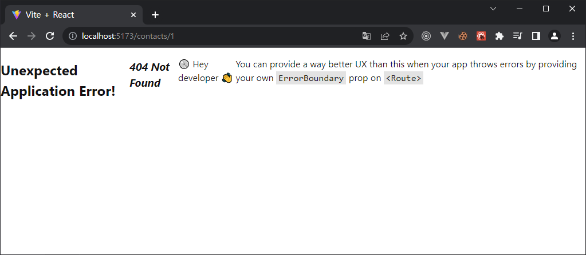

구려요! 이 앱의 루트 요소에 있는 flex box 스타일로 인해 더 심해진 React 라우터의 기본 오류 화면입니다 😂.

렌더링, 데이터 로드 또는 데이터 변이를 수행하는 동안 앱에서 오류가 발생할 때마다 React Router는 오류를 포착하고 오류 화면을 렌더링합니다. 나만의 오류 페이지를 만들어 봅시다.

**👉 오류 페이지 구성 요소 만들기**

```sh
touch src/error-page.jsx
```

* `src/error-page.jsx`

  ```jsx
  import { useRouteError } from "react-router-dom";
  
  export default function ErrorPage() {
    const error = useRouteError();
    console.error(error);
  
    return (
      <div id="error-page">
        <h1>Oops!</h1>
        <p>Sorry, an unexpected error has occurred.</p>
        <p>
          <i>{error.statusText || error.message}</i>
        </p>
      </div>
    );
  }
  ```

👉 root route에서 `<ErrorPage>`를 [`errorElement`](https://reactrouter.com/en/main/route/error-element)로 설정

* `src/main.jsx`

  ```jsx
  /* previous imports */
  import ErrorPage from "./error-page";
  
  const router = createBrowserRouter([
    {
      path: "/",
      element: <Root />,
      errorElement: <ErrorPage />,
    },
  ]);
  
  ReactDOM.createRoot(document.getElementById("root")).render(
    <React.StrictMode>
      <RouterProvider router={router} />
    </React.StrictMode>
  );
  ```

  오류 페이지는 이제 다음과 같아야 합니다.

  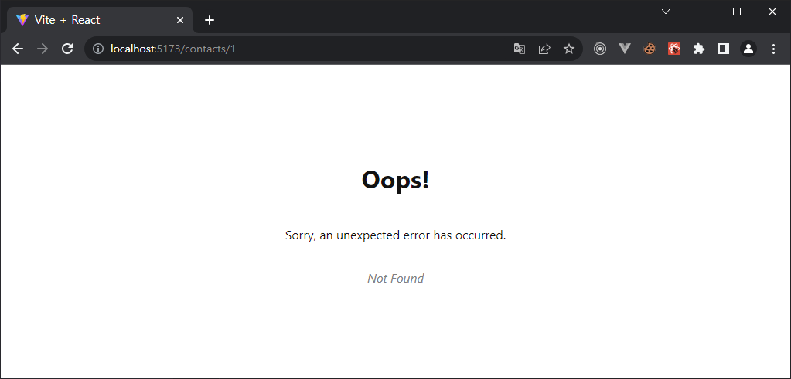

(별로 나아지지 않았습니다. 누군가 디자이너에게 오류 페이지를 만들어 달라고 요청하는 것을 잊어버렸을 수도 있습니다. 디자이너에게 오류 페이지를 만들어 달라고 요청하는 것을 잊어버리고 디자이너가 생각하지 못했다고 디자이너를 탓할 수도 있겠죠 😆)

[`useRouteError`](https://reactrouter.com/en/main/hooks/use-route-error)는 발생한 오류를 제공합니다. 사용자가 존재하지 않는 경로로 이동하면 "Not Found" `statusText`가 포함된 [오류 응답](https://reactrouter.com/en/main/utils/is-route-error-response)을 받게 됩니다. 튜토리얼의 뒷부분에서 몇 가지 다른 오류를 살펴보고 이에 대해 자세히 설명하겠습니다.

지금은 무한 회전(infinite spinners), 응답하지 않는 페이지 또는 빈 화면 대신 이 페이지에서 거의 모든 오류를 처리할 수 있다는 것만으로도 충분합니다 🙌.


## 연락처 Route UI

404 "Not Found" 페이지 대신 링크한 URL에 실제로 무언가를 렌더링하고 싶습니다. 그러기 위해서는 새로운 경로를 만들어야 합니다.

**👉 연락처 route 모듈 생성**

```sh
touch src/routes/contact.jsx
```

👉 **연락처 컴포넌트 UI 추가**

여러 요소로 구성되어 있으므로 자유롭게 복사/붙여넣기할 수 있습니다.

* `src/route/contact.jsx`

  ```jsx
  import { Form } from "react-router-dom";
  
  export default function Contact() {
    const contact = {
      first: "Your",
      last: "Name",
      avatar: "https://placekitten.com/g/200/200",
      twitter: "your_handle",
      notes: "Some notes",
      favorite: true,
    };
  
    return (
      <div id="contact">
        <div>
          
        </div>
  
        <div>
          <h1>
            {contact.first || contact.last ? (
              <>
                {contact.first} {contact.last}
              </>
            ) : (
              <i>No Name</i>
            )}{" "}
            <Favorite contact={contact} />
          </h1>
  
          {contact.twitter && (
            <p>
              <a
                target="_blank"
                href={`https://twitter.com/${contact.twitter}`}
              >
                {contact.twitter}
              </a>
            </p>
          )}
  
          {contact.notes && <p>{contact.notes}</p>}
  
          <div>
            <Form action="edit">
              <button type="submit">Edit</button>
            </Form>
            <Form
              method="post"
              action="destroy"
              onSubmit={(event) => {
                if (
                  !confirm(
                    "Please confirm you want to delete this record."
                  )
                ) {
                  event.preventDefault();
                }
              }}
            >
              <button type="submit">Delete</button>
            </Form>
          </div>
        </div>
      </div>
    );
  }
  
  function Favorite({ contact }) {
    // yes, this is a `let` for later
    let favorite = contact.favorite;
    return (
      <Form method="post">
        <button
          name="favorite"
          value={favorite ? "false" : "true"}
          aria-label={
            favorite
              ? "Remove from favorites"
              : "Add to favorites"
          }
        >
          {favorite ? "★" : "☆"}
        </button>
      </Form>
    );
  }
  ```

  이제 컴포넌트가 생겼으니 새 경로에 연결해 보겠습니다.

👉 연락처 컴포넌트 가져오기 및 새 경로 만들기

* `src/main.jsx`

  ```jsx
  /* existing imports */
  import Contact from "./routes/contact";
  
  const router = createBrowserRouter([
    {
      path: "/",
      element: <Root />,
      errorElement: <ErrorPage />,
    },
    {
      path: "contacts/:contactId",
      element: <Contact />,
    },
  ]);
  
  /* existing code */
  ```

이제 링크 중 하나를 클릭하거나 `/contacts/1`을 방문하면 새 구성 요소가 표시됩니다!

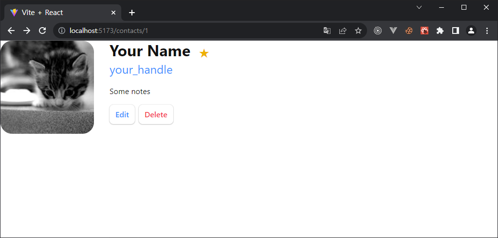

하지만 루트 레이아웃 내부에 있지 않습니다 😠.


## 중첩 라우트

우리는 연락처 컴포넌트가 다음과 같이 `<Root>` 레이아웃 내부에서 렌더링되기를 원합니다.

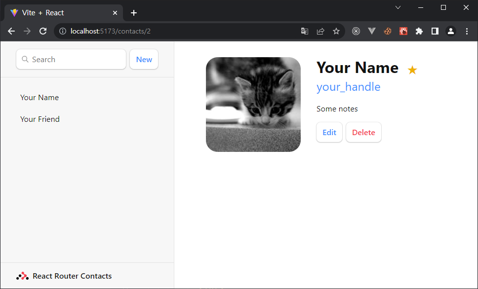

연락처 경로를 루트 경로의 *하위 (child)* 경로로 만들면 됩니다.

👉 연락처 경로를 루트 경로의 하위 경로로 이동합니다.

* `src/main.jsx`

  ```jsx
  const router = createBrowserRouter([
    {
      path: "/",
      element: <Root />,
      errorElement: <ErrorPage />,
      children: [
        {
          path: "contacts/:contactId",
          element: <Contact />,
        },
      ],
    },
  ]);
  ```

이제 루트 레이아웃이 다시 표시되지만 오른쪽에 여전히 빈 페이지가 표시됩니다. 루트 경로에 하위 경로를 렌더링할 위치를 알려줘야 합니다. [`<Outlet>`](https://reactrouter.com/en/main/components/outlet)으로 이를 수행합니다.

`<div id="detail">`를 찾아 outlet 안에 넣습니다.

**👉 [`<Outlet>`](https://reactrouter.com/en/main/components/outlet) 렌더링하기**

* `src/routes/root.jsx`

  ```jsx
  import { Outlet } from "react-router-dom";
  
  export default function Root() {
    return (
      <>
        {/* all the other elements */}
        <div id="detail">
          <Outlet />
        </div>
      </>
    );
  }
  ```

  

## 클라이언트 측 라우팅

눈치채셨을 수도 있고 그렇지 않으셨을 수도 있지만, 사이드바의 링크를 클릭하면 브라우저는 React 라우터를 사용하는 대신 다음 URL에 대한 전체 문서 요청을 수행합니다.

클라이언트 측 라우팅을 사용하면 앱이 서버에 다른 문서를 요청하지 않고도 URL을 업데이트할 수 있습니다. 대신 앱은 즉시 새 UI를 렌더링할 수 있습니다. [`<Link>`](https://reactrouter.com/en/main/components/link)를 통해 이를 구현해 보겠습니다.

**👉 사이드바의 `<a href>`를 `<Link>`로 변경합니다.**

* `src/routes/root.jsx`

  ```jsx
  import { Outlet, Link } from "react-router-dom";
  
  export default function Root() {
    return (
      <>
        <div id="sidebar">
          {/* other elements */}
  
          <nav>
            <ul>
              <li>
                <Link to={`contacts/1`}>Your Name</Link>
              </li>
              <li>
                <Link to={`contacts/2`}>Your Friend</Link>
              </li>
            </ul>
          </nav>
  
          {/* other elements */}
        </div>
      </>
    );
  }
  ```

  브라우저 개발자 도구에서 네트워크 탭을 열어 더 이상 문서를 요청하지 않는지 확인할 수 있습니다.


## 데이터 로드

URL 세그먼트, 레이아웃, 데이터는 종종 함께 결합되어(세 배로?) 있습니다. 이 앱에서 이미 확인할 수 있습니다:

| URL 세그먼트 | 컴포넌트    | 데이터      |
| ------------ | ----------- | ----------- |
| /            | `<Root>`    | 연락처 목록 |
| contacts/:id | `<Contact>` | 개별 연락처 |

이러한 자연스러운 결합으로 인해 React 라우터에는 경로 구성 요소에 데이터를 쉽게 가져올 수 있는 데이터 규칙이 있습니다.

데이터를 로드하는 데 사용할 두 가지 API는 [`loader`](https://reactrouter.com/en/main/route/loader)와 [`useLoaderData`](https://reactrouter.com/en/main/hooks/use-loader-data)입니다. 먼저 Root 모듈에서 loader 함수를 생성하고 내보낸 다음 route에 연결합니다. 마지막으로 데이터에 액세스하고 렌더링합니다.

👉 root.jsx에서 loader 내보내기

* `src/routes/root.jsx`

  ```jsx
  import { Outlet, Link } from "react-router-dom";
  import { getContacts } from "../contacts";
  
  export async function loader() {
    const contacts = await getContacts();
    return { contacts };
  }
  ```

**👉 route에서 loader 구성하기**

* `src/main.jsx`

  ```jsx
  /* other imports */
  import Root, { loader as rootLoader } from "./routes/root";
  
  const router = createBrowserRouter([
    {
      path: "/",
      element: <Root />,
      errorElement: <ErrorPage />,
      loader: rootLoader,
      children: [
        {
          path: "contacts/:contactId",
          element: <Contact />,
        },
      ],
    },
  ]);
  ```

  

**👉 데이터 엑세스 및 렌더링**

* `src/routes/root.jsx`

  ```jsx
  import {
    Outlet,
    Link,
    useLoaderData,
  } from "react-router-dom";
  import { getContacts } from "../contacts";
  
  /* other code */
  
  export default function Root() {
    const { contacts } = useLoaderData();
    return (
      <>
        <div id="sidebar">
          <h1>React Router Contacts</h1>
          {/* other code */}
  
          <nav>
            {contacts.length ? (
              <ul>
                {contacts.map((contact) => (
                  <li key={contact.id}>
                    <Link to={`contacts/${contact.id}`}>
                      {contact.first || contact.last ? (
                        <>
                          {contact.first} {contact.last}
                        </>
                      ) : (
                        <i>No Name</i>
                      )}{" "}
                      {contact.favorite && <span>★</span>}
                    </Link>
                  </li>
                ))}
              </ul>
            ) : (
              <p>
                <i>No contacts</i>
              </p>
            )}
          </nav>
  
          {/* other code */}
        </div>
      </>
    );
  }
  ```

  이제 끝입니다! 이제 React 라우터가 자동으로 해당 데이터를 UI와 동기화합니다. 아직 데이터가 없으므로 이와 같은 빈 목록이 표시될 것입니다:

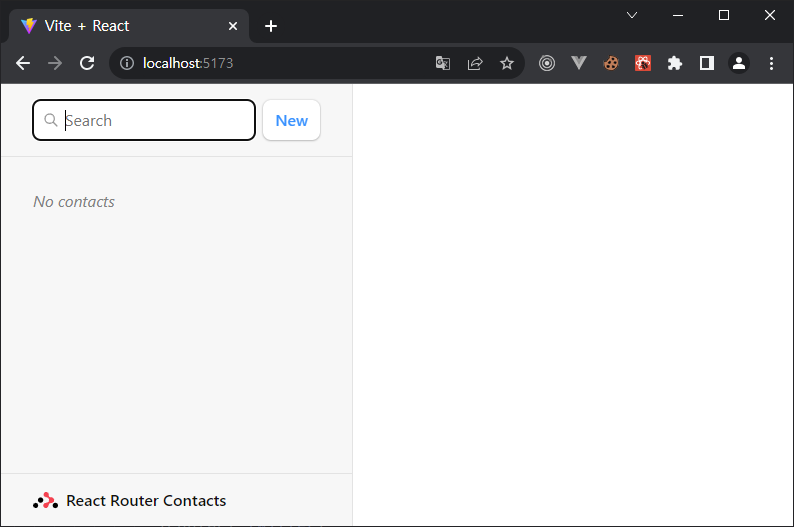


## 데이터 쓰기 + HTML 폼

첫 번째 접점은 잠시 후에 만들겠지만, 먼저 HTML에 대해 이야기해 보겠습니다.

React 라우터는 자바스크립트 캄브리아기 폭발 이전의 웹 개발에 따라 데이터 변이 프리미티브로서 HTML 양식 탐색을 에뮬레이트합니다. "구식" 웹 모델의 단순함과 함께 클라이언트 렌더링 앱의 UX 기능을 제공합니다.

일부 웹 개발자에게는 생소할 수 있지만 HTML 양식은 실제로 링크를 클릭하는 것과 마찬가지로 브라우저에서 탐색을 유발합니다. 유일한 차이점은 요청에 있습니다. 링크는 URL만 변경할 수 있지만 양식은 요청 방법(GET 대 POST)과 요청 본문(POST 양식 데이터)도 변경할 수 있습니다.

클라이언트 측 라우팅이 없으면 브라우저는 양식의 데이터를 자동으로 직렬화하여 POST의 경우 요청 본문으로, GET의 경우 URLSearchParams로 서버에 전송합니다. React 라우터도 동일한 작업을 수행하지만 요청을 서버로 보내는 대신 클라이언트 측 라우팅을 사용하여 [`action`](https://reactrouter.com/en/main/route/action) 경로로 전송합니다.

앱에서 "새로 만들기" 버튼을 클릭하여 이를 테스트해 볼 수 있습니다. Vite 서버가 POST 요청을 처리하도록 구성되지 않았기 때문에 앱이 폭파되어야 합니다(404를 보내지만 405 가 되어야 함 🤷).

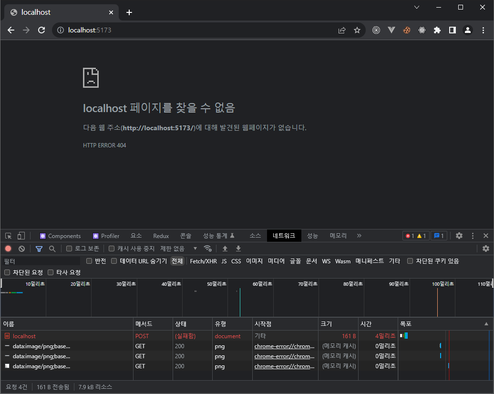

새 연락처를 생성하기 위해 해당 POST를 Vite 서버로 보내는 대신 클라이언트 측 라우팅을 사용해 보겠습니다.


## 연락처 만들기

루트 경로에서 `action`을 내보내고, 경로 구성에 연결하고, `<form>`을 React Router [`<Form>`](https://reactrouter.com/en/main/components/form)으로 변경하여 새 연락처를 생성하겠습니다.

**👉 액션을 만들고 `<form>`을 `<Form>`으로 변경합니다.**

* `src/routes/root.jsx`

  ```jsx
  import {
    Outlet,
    Link,
    useLoaderData,
    Form,
  } from "react-router-dom";
  import { getContacts, createContact } from "../contacts";
  
  export async function action() {
    const contact = await createContact();
    return { contact };
  }
  
  /* other code */
  
  export default function Root() {
    const { contacts } = useLoaderData();
    return (
      <>
        <div id="sidebar">
          <h1>React Router Contacts</h1>
          <div>
            {/* other code */}
            <Form method="post">
              <button type="submit">New</button>
            </Form>
          </div>
  
          {/* other code */}
        </div>
      </>
    );
  }
  ```

**👉 경로에 대한 action 가져오기 및 설정**

* `src/main.jsx`

  ```jsx
  /* other imports */
  
  import Root, {
    loader as rootLoader,
    action as rootAction,
  } from "./routes/root";
  
  const router = createBrowserRouter([
    {
      path: "/",
      element: <Root />,
      errorElement: <ErrorPage />,
      loader: rootLoader,
      action: rootAction,
      children: [
        {
          path: "contacts/:contactId",
          element: <Contact />,
        },
      ],
    },
  ]);
  ```

그게 다야! 계속해서 "New" 버튼을 클릭하면 목록에 새 레코드 팝업이 표시됩니다 🥳

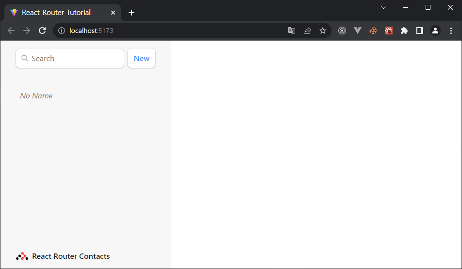

`createContact` 메소드는 이름이나 데이터 또는 아무것도 없는 빈 연락처를 생성합니다. 그러나 그것은 여전히 기록을 만듭니다. 약속합니다!

> 🧐 잠깐만요... 사이드바는 어떻게 업데이트 되었나요? `action`을 어디에서 호출했습니까? 데이터를 다시 가져오는 코드는 어디에 있습니까? `useState`, `onSubmit` 및 `useEffect`는 어디에 있습니까?!

여기서 "구식 웹" 프로그래밍 모델이 나타납니다. 앞서 설명한 것처럼 [`<Form>`](https://reactrouter.com/en/main/components/form)은 브라우저가 요청을 서버로 보내는 것을 방지하고 대신 라우팅 액션으로 요청을 보냅니다. 웹 시맨틱에서 POST는 일반적으로 일부 데이터가 변경된다는 것을 의미합니다. 관례에 따라 React 라우터는 이를 힌트로 사용해 액션이 완료된 후 페이지의 데이터를 자동으로 재검증합니다. 즉, 모든 useLoaderData 훅이 업데이트되고 UI가 자동으로 데이터와 동기화 상태를 유지합니다! 아주 멋지죠.


## 로더의 URL 매개변수

**👉 No Name 레코드를 클릭 합니다.**

이전 정적 연락처 페이지가 다시 표시되지만 한 가지 차이점이 있습니다. 이제 URL에 레코드에 대한 실제 ID가 있다는 점입니다.

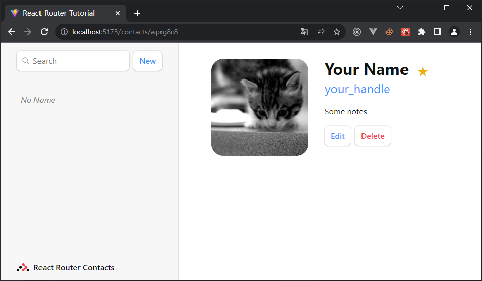

경로 구성을 검토하면 다음과 같은 경로가 표시됩니다:

```jsx
[
  {
    path: 'contacts/:contactId',
    element: <Contact />
  }
]
```

`contactId` URL 세그먼트에 주목하세요. 콜론(`:`)은 특별한 의미를 가지며 "동적 세그먼트(Dynamic segment)"로 바뀝니다. 동적 세그먼트는 연락처 ID와 같이 URL의 해당 위치에서 동적(변경되는) 값과 일치합니다. URL에서 이러한 값을 "URL 매개변수" 또는 줄여서 "매개변수(params)"라고 부릅니다.

이러한 [`params`](https://reactrouter.com/en/main/route/loader#params)는 동적 세그먼트와 일치하는 키와 함께 로더에 전달됩니다. 예를 들어, 세그먼트의 이름은 :contactId이므로 값은 `params.contactId`로 전달됩니다.

이 매개변수는 ID로 레코드를 찾는 데 가장 자주 사용됩니다. 한번 사용해 보겠습니다.

**👉 연락처 페이지에 로더를 추가하고 `useLoaderData`를 사용하여 데이터에 액세스합니다.**

* `src/route/contact.jsx`

  ```jsx
  import { Form, useLoaderData } from "react-router-dom";
  import { getContact } from "../contacts";
  
  export async function loader({ params }) {
    const contact = await getContact(params.contactId);
    return { contact };
  }
  
  export default function Contact() {
    const { contact } = useLoaderData();
    // existing code
  }
  ```

**👉 경로에서 로더 구성**

* `src/main.jsx`

  ```jsx
  /* existing code */
  import Contact, {
    loader as contactLoader,
  } from "./routes/contact";
  
  const router = createBrowserRouter([
    {
      path: "/",
      element: <Root />,
      errorElement: <ErrorPage />,
      loader: rootLoader,
      action: rootAction,
      children: [
        {
          path: "contacts/:contactId",
          element: <Contact />,
          loader: contactLoader,
        },
      ],
    },
  ]);
  
  /* existing code */
  ```

  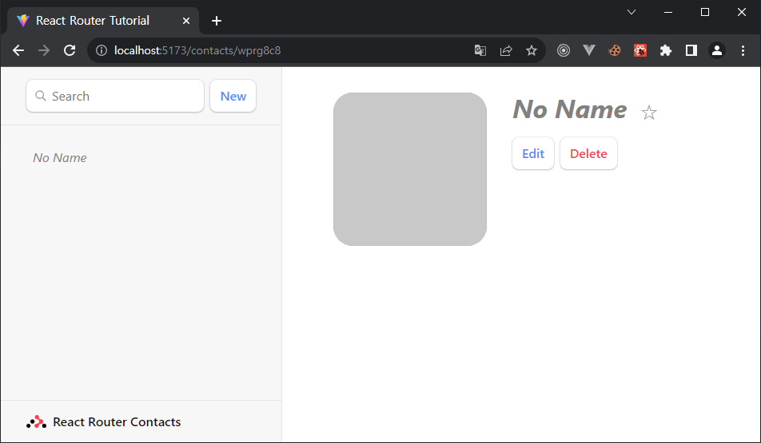


## 데이터 업데이트

데이터를 만들 때와 마찬가지로 [`<Form>`](https://reactrouter.com/en/main/components/form)으로 데이터를 업데이트합니다. `contacts/:contactId/edit`에 새 경로를 만들어 보겠습니다. 이번에도 컴포넌트로 시작한 다음 경로 구성에 연결하겠습니다.

👉 **edit 컴포넌트 만들기**

```sh
touch src/routes/edit.jsx
```

**👉 edit 페이지 UI 추가**

이전에 본 적이 없는 내용은 자유롭게 복사/붙여넣기하세요:

* `src/routes/edit.jsx`

  ```jsx
  import { Form, useLoaderData } from "react-router-dom";
  
  export default function EditContact() {
    const { contact } = useLoaderData();
  
    return (
      <Form method="post" id="contact-form">
        <p>
          <span>Name</span>
          <input
            placeholder="First"
            aria-label="First name"
            type="text"
            name="first"
            defaultValue={contact.first}
          />
          <input
            placeholder="Last"
            aria-label="Last name"
            type="text"
            name="last"
            defaultValue={contact.last}
          />
        </p>
        <label>
          <span>Twitter</span>
          <input
            type="text"
            name="twitter"
            placeholder="@jack"
            defaultValue={contact.twitter}
          />
        </label>
        <label>
          <span>Avatar URL</span>
          <input
            placeholder="https://example.com/avatar.jpg"
            aria-label="Avatar URL"
            type="text"
            name="avatar"
            defaultValue={contact.avatar}
          />
        </label>
        <label>
          <span>Notes</span>
          <textarea
            name="notes"
            defaultValue={contact.notes}
            rows={6}
          />
        </label>
        <p>
          <button type="submit">Save</button>
          <button type="button">Cancel</button>
        </p>
      </Form>
    );
  }
  ```

  **👉 새로운 edit 경로 추가**

  * `src/main.jsx`

    ```jsx
    /* existing code */
    import EditContact from "./routes/edit";
    
    const router = createBrowserRouter([
      {
        path: "/",
        element: <Root />,
        errorElement: <ErrorPage />,
        loader: rootLoader,
        action: rootAction,
        children: [
          {
            path: "contacts/:contactId",
            element: <Contact />,
            loader: contactLoader,
          },
          {
            path: "contacts/:contactId/edit",
            element: <EditContact />,
            loader: contactLoader,
          },
        ],
      },
    ]);
    
    /* existing code */
    ```

    

    루트 경로의 outlet에서 렌더링되기를 원하므로 기존 하위 경로의 형제 경로로 만들었습니다.

    (이 경로에 `contactLoader`를 재사용한 것을 알 수 있습니다. 이는 튜토리얼에서 게으르기 때문일 뿐입니다. 라우트 간에 로더를 공유하려고 시도할 이유는 없습니다. 보통 라우트마다 고유한 로더가 있기 때문입니다).

    이제 "Edit" 버튼을 클릭하면 새로운 UI가 표시됩니다:

  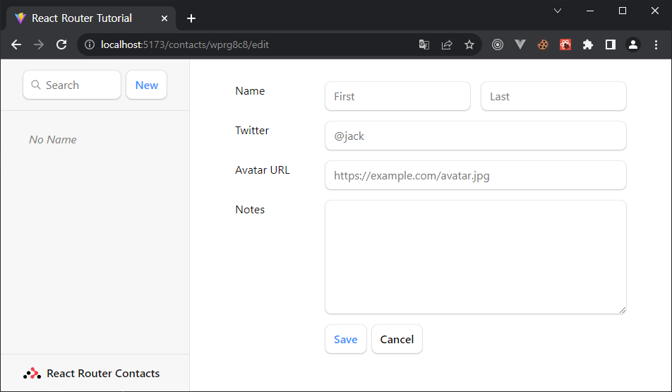


## FormData로 연락처 업데이트하기

방금 만든 edit 경로가 이미 양식을 렌더링하고 있습니다. 레코드를 업데이트하기 위해 해야 할 일은 경로에 action을 연결하기만 하면 됩니다. 양식이 action에 게시되고 데이터가 자동으로 재검증됩니다.

👉 **edit 모듈에 action 추가**

* `src/routes/edit.jsx`

  ```jsx
  import {
    Form,
    useLoaderData,
    redirect,
  } from "react-router-dom";
  import { updateContact } from "../contacts";
  
  export async function action({ request, params }) {
    const formData = await request.formData();
    const updates = Object.fromEntries(formData);
    await updateContact(params.contactId, updates);
    return redirect(`/contacts/${params.contactId}`);
  }
  
  /* existing code */
  ```

**👉 action을 경로에 연결**

* `src/main/jsx`

  ```jsx
  /* existing code */
  import EditContact, {
    action as editAction,
  } from "./routes/edit";
  
  const router = createBrowserRouter([
    {
      path: "/",
      element: <Root />,
      errorElement: <ErrorPage />,
      loader: rootLoader,
      action: rootAction,
      children: [
        {
          path: "contacts/:contactId",
          element: <Contact />,
          loader: contactLoader,
        },
        {
          path: "contacts/:contactId/edit",
          element: <EditContact />,
          loader: contactLoader,
          action: editAction,
        },
      ],
    },
  ]);
  
  /* existing code */
  ```

양식을 작성하고 저장을 누르면 다음과 같은 화면이 표시됩니다! (눈이 더 편하고 털이 덜 난다는 점만 빼면요.)

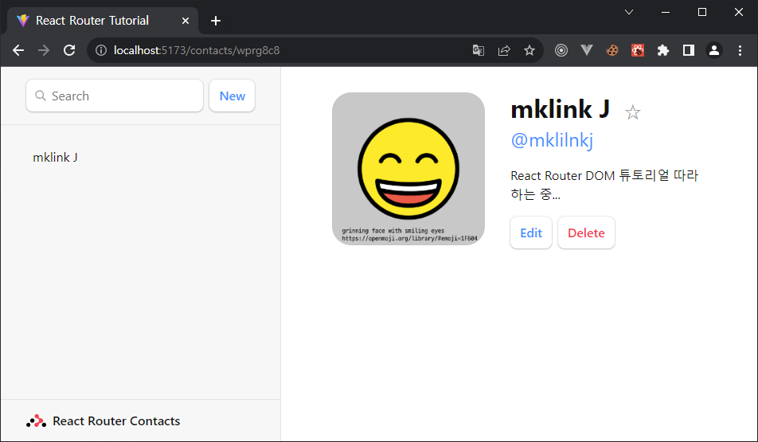


## [변화(Mutation) 논의](https://reactrouter.com/en/main/start/tutorial#mutation-discussion)

> 😑 작동은 했는데, 여기서 무슨일이 일어나고 있는지 모르겠어요...

조금 더 자세히 살펴봅시다...

`src/routes/edit.jsx`를 열고 양식 요소를 살펴봅니다. 각 요소에 이름이 있는 것을 주목하세요:

* `src/routes/edit.jsx`

  ```jsx
  <input
    placeholder="First"
    aria-label="First name"
    type="text"
    name="first"
    defaultValue={contact.first}
  />
  ```

자바스크립트 없이, 양식이 제출되면 브라우저는 [`FormData`](https://developer.mozilla.org/en-US/docs/Web/API/FormData)를 생성하고 이를 서버로 보낼 때 요청의 본문으로 설정합니다. 앞서 언급했듯이 React 라우터는 이를 방지하고 대신 [`FormData`](https://developer.mozilla.org/en-US/docs/Web/API/FormData)를 포함한 요청을 사용자의 액션으로 전송합니다.

양식의 각 필드는 `formData.get(name)`을 사용하여 액세스할 수 있습니다. 예를 들어 위의 입력 필드가 주어지면 다음과 같이 이름과 성에 액세스할 수 있습니다:

```javascript
export async function action({ request, params }) {
  const formData = await request.formData();
  const firstName = formData.get("first");
  const lastName = formData.get("last");
  // ...
}
```

몇 개의 양식 필드가 있으므로 [`Object.fromEntries`](https://developer.mozilla.org/en-US/docs/Web/JavaScript/Reference/Global_Objects/Object/fromEntries)를 사용하여 모든 필드를 객체로 수집했으며, 이는 `updateContact` 함수가 원하는 것과 정확히 일치합니다.

```javascript
const updates = Object.fromEntries(formData);
updates.first; // "Some"
updates.last; // "Name"
```

`action`을 제외하고, 우리가 논의하는 이 API들 중 어느 것도 React Router에서 제공하지 않습니다: [`request`](https://developer.mozilla.org/en-US/docs/Web/API/Request), [`request.formData`](https://developer.mozilla.org/en-US/docs/Web/API/Request/formData), [`Object.fromEntries`](https://developer.mozilla.org/en-US/docs/Web/JavaScript/Reference/Global_Objects/Object/fromEntries)는 모두 웹 플랫폼에서 제공합니다.

액션을 완료한 후 마지막에 [`redirect`](https://reactrouter.com/en/main/fetch/redirect)를 주목하세요:

* `src/routes/edit.jsx`

  ```jsx
  export async function action({ request, params }) {
    const formData = await request.formData();
    const updates = Object.fromEntries(formData);
    await updateContact(params.contactId, updates);
    return redirect(`/contacts/${params.contactId}`);
  }
  ```

로더와 액션은 모두 [`Response`을 반환](https://reactrouter.com/en/main/route/loader#returning-responses)할 수 있습니다([`Request`](https://developer.mozilla.org/en-US/docs/Web/API/Request)을 받았으니 당연한 일입니다!). [`redirect`](https://reactrouter.com/en/main/fetch/redirect) 헬퍼는 앱에 위치 변경을 지시하는 [`response`](https://developer.mozilla.org/en-US/docs/Web/API/Response)을 더 쉽게 반환할 수 있도록 해줍니다.

클라이언트 측 라우팅이 없으면 서버가 POST 요청 후 리디렉션되면 새 페이지가 최신 데이터를 가져와 렌더링합니다. 앞서 배운 것처럼 React 라우터는 이 모델을 에뮬레이션하고 액션 후 페이지의 데이터를 자동으로 재검증합니다. 양식을 저장할 때 사이드바가 자동으로 업데이트되는 이유입니다. 추가 재검증 코드는 클라이언트 측 라우팅 없이는 존재하지 않으므로 클라이언트 측 라우팅과 함께 존재할 필요도 없습니다!

> 🎈 리다이렉트를 해도 리엑트 라우터가 알아서 페이지를 업데이트 해준다는 말 같음, 클라언트 측 라우팅이 없을 경우 전체 페이지 리로드가 발생하는 경우 없이...


## [새 레코드를 편집 페이지로 리디렉션하기](https://reactrouter.com/en/main/start/tutorial#redirecting-new-records-to-the-edit-page)

이제 리디렉션하는 방법을 알았으니 새 연락처를 만드는 작업을 편집 페이지로 리디렉션하도록 업데이트해 보겠습니다:

**👉 새 레코드의 편집 페이지로 리디렉션합니다.**

* `src/routes/root.jsx`

  ```jsx
  import {
    Outlet,
    Link,
    useLoaderData,
    Form,
    redirect, //*
  } from "react-router-dom";
  import { getContacts, createContact } from "../contacts";
  
  export async function action() {
    const contact = await createContact();
    return redirect(`/contacts/${contact.id}/edit`); //*
  }
  ```

이제 "New"를 클릭하면 편집 페이지로 이동합니다:

> 🎈 지금 까지는 New 버튼을 누르면 그냥 이름 없는(No Name) 연락처를 생성했었음.

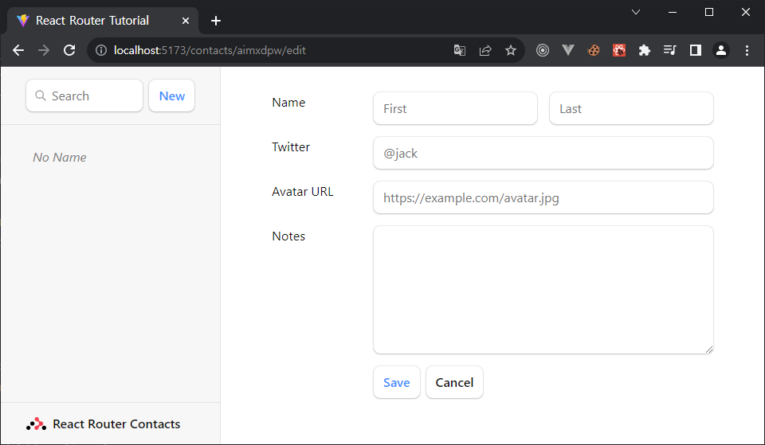

**👉 몇 개의 레코드 추가하기**

첫 번째 리믹스 컨퍼런스의 화려한 연사 라인업을 그대로 사용하려고 합니다 😁.

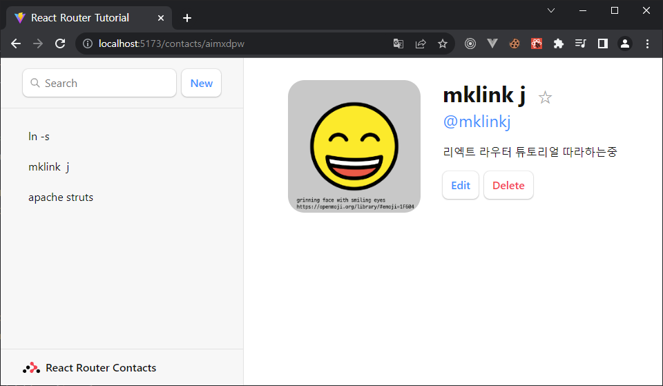

> 🎈 저자님처럼 많은 내용은 못넣고 3개만 추가해봄.


## [액티브 링크 스타일링](https://reactrouter.com/en/main/start/tutorial#active-link-styling)

이제 많은 레코드가 있으므로 사이드바에서 어떤 레코드를 보고 있는지 명확하지 않습니다. [`NavLink`](https://reactrouter.com/en/main/components/nav-link)를 사용하면 이 문제를 해결할 수 있습니다.

**👉 사이드바에서 내비링크 사용**

* **src/routes/root.jsx**

  ```jsx
  import {
    Outlet,
    NavLink,
    useLoaderData,
    Form,
    redirect,
  } from "react-router-dom";
  
  export default function Root() {
    return (
      <>
        <div id="sidebar">
          {/* other code */}
  
          <nav>
            {contacts.length ? (
              <ul>
                {contacts.map((contact) => (
                  <li key={contact.id}>
                    <NavLink
                      to={`contacts/${contact.id}`}
                      className={({ isActive, isPending }) =>
                        isActive
                          ? "active"
                          : isPending
                          ? "pending"
                          : ""
                      }
                    >
                      {/* other code */}
                    </NavLink>
                  </li>
                ))}
              </ul>
            ) : (
              <p>{/* other code */}</p>
            )}
          </nav>
        </div>
      </>
    );
  }
  ```

  `className`에 함수를 전달하고 있다는 점에 유의하세요. 사용자가 `NavLink`의 URL에 있으면 `isActive`가 참이 됩니다. 활성화되려고 하면(데이터가 아직 로드 중인 상태) `isPending`이 참이 됩니다. 이를 통해 사용자가 어디에 있는지 쉽게 표시할 수 있을 뿐만 아니라 클릭했지만 데이터가 로드되기를 기다리는 링크에 대한 즉각적인 피드백을 제공할 수 있습니다.

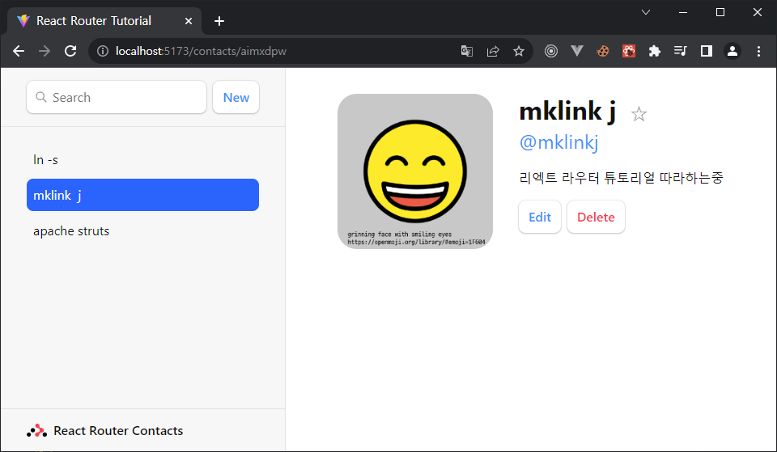


## [레코드 삭제하기](https://reactrouter.com/en/main/start/tutorial#deleting-records)

연락처 route의 코드를 검토하면 삭제 버튼이 다음과 같이 표시되어 있음을 알 수 있습니다:

* `src/routes/contact.jsx`

  ```jsx
  <Form
    method="post"
    action="destroy"
    onSubmit={(event) => {
      if (
        !confirm(
          "Please confirm you want to delete this record."
        )
      ) {
        event.preventDefault();
      }
    }}
  >
    <button type="submit">Delete</button>
  </Form>
  ```

  

액션이 "`destroy`"를 가리키고 있음을 주목하세요. `<Link to>`과 마찬가지로 `<Form action>`도 상대값을 사용할 수 있습니다. 양식이 `contact/:contactId`에 렌더링되므로 `destroy`가 포함된 상대 액션은 클릭 시 양식을 `contact/:contactId/destroy`로 제출합니다.

이 시점에서 삭제 버튼을 작동시키기 위해 알아야 할 모든 것을 알 수 있을 것입니다. 계속 진행하기 전에 한 번 해보시겠습니까? 다음이 필요합니다:

1. 새 route
2. 해당 route에서의 `action`
3. `src/contacts.js`에서 `deleteContact`

**👉 "destory" route 모듈 만들기**

```sh
touch src/routes/destroy.jsx
```

**👉 destory 액션 추가**

* `src/routes/destory.jsx`

  ```jsx
  import { redirect } from "react-router-dom";
  import { deleteContact } from "../contacts";
  
  export async function action({ params }) {
    await deleteContact(params.contactId);
    return redirect("/");
  }
  ```

  

**👉 route 구성에 destory route를 추가합니다.**

* `src/main.jsx`

  ```jsx
  /* existing code */
  import { action as destroyAction } from "./routes/destroy";
  
  const router = createBrowserRouter([
    {
      path: "/",
      /* existing root route props */
      children: [
        /* existing routes */
        {
          path: "contacts/:contactId/destroy",
          action: destroyAction,
        },
      ],
    },
  ]);
  
  /* existing code */
  ```

이제 레코드로 이동해 "Delete" 버튼을 클릭합니다. 작동합니다!

> 😅 나는 이 모든 것이 왜 작동하는지 여전히 혼란스럽습니다.

사용자가 제출 버튼을 클릭할 때...:

1. `<Form>`은 서버에 새 POST 요청을 보내는 기본 브라우저 동작을 방지하는 대신 클라이언트 측 라우팅을 사용하여 POST 요청을 생성하여 브라우저를 에뮬레이트합니다.
2. `<Form action="destroy">`는 "`contacts/:contactId/destroy`"의 새 경로와 일치하여 요청을 보냅니다.
3. 액션이 리디렉션된 후, React 라우터는 페이지의 데이터에 대한 모든 로더를 호출하여 최신 값을 가져옵니다("재검증(revalidation)"). `useLoaderData`는 새 값을 반환하고 컴포넌트가 업데이트되도록 합니다!

양식을 추가하고 액션을 추가하면 나머지는 React 라우터가 알아서 처리합니다.


## 컨텍스트 에러
재미 삼아 destroy 액션에 에러를 던져보세요:

* `src/routes/destory.jsx`

  ```jsx
  export async function action({ params }) {
    throw new Error("oh dang!");    //*
    await deleteContact(params.contactId);
    return redirect("/");
  }
  ```

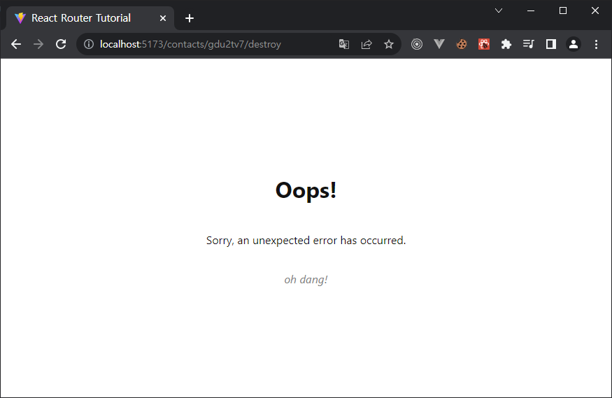

이 화면을 기억하시나요? 앞서 살펴본 [`errorElement`](https://reactrouter.com/en/main/route/error-element)입니다. 하지만 사용자는 새로 고침을 누르는 것 외에는 이 화면에서 복구할 수 있는 방법이 없습니다.

destroy 경로에 대한 상황에 맞는 오류 메시지를 만들어 보겠습니다:

* `src/main.jsx`

  ```jsx
  [
    /* other routes */
    {
      path: "contacts/:contactId/destroy",
      action: destroyAction,
      errorElement: <div>Oops! There was an error.</div>,
    },
  ];
  ```

이제 다시 시도해 보세요:

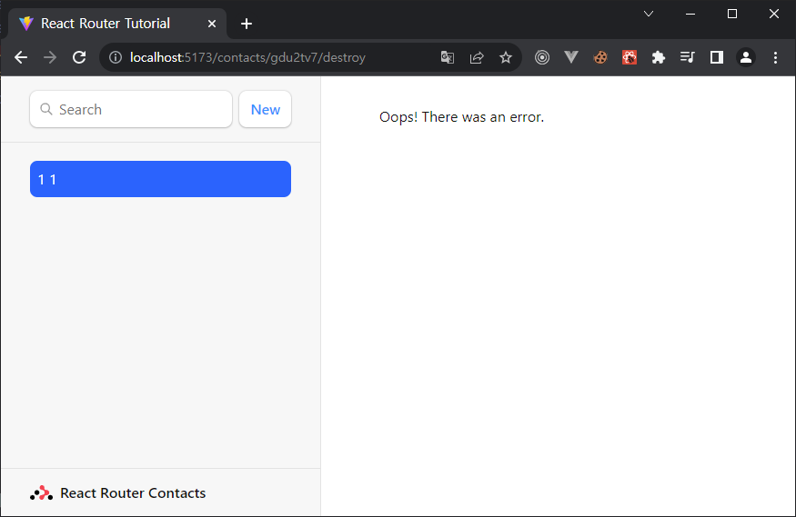

이제 사용자는 새로 고침을 강행하는 대신 문제가 없는 페이지 부분과 계속 상호 작용할 수 있습니다 🙌.

destroy 경로에는 자체 `errorElement`가 있고 루트 경로의 자식이므로 오류가 루트 대신에 렌더링됩니다. 눈치채셨겠지만, 이러한 오류는 가장 가까운 `errorElement`까지 퍼집니다. 루트에 하나만 있으면 원하는 만큼 추가할 수 있습니다.


## [인덱스 라우트](https://reactrouter.com/en/main/start/tutorial#index-routes)

앱을 로드하면 목록 오른쪽에 커다란 빈 페이지가 표시됩니다.

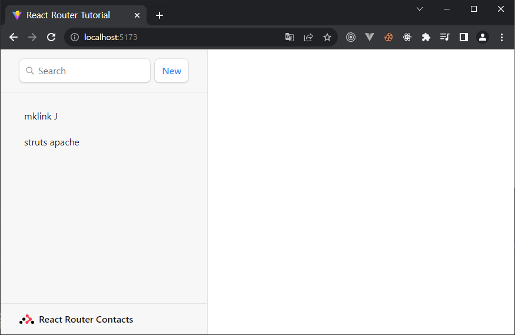

경로에 자식이 있고 부모 경로의 경로에 있는 경우 일치하는 자식이 없기 때문에 `<Outlet>`은 렌더링할 항목이 없습니다. 인덱스 경로를 해당 공간을 채우는 기본 자식 경로로 생각할 수 있습니다.

**👉 index 경로 모듈 생성**

```sh
touch src/routes/index.jsx
```

**👉 인덱스 컴포넌트의 요소를 채우기**

자유롭게 붙여넣기를 복사하세요. 여기에 특별한 것은 없습니다.

* `src/routes/index.jsx`

  ```jsx
  export default function Index() {
    return (
      <p id="zero-state">
        This is a demo for React Router.
        <br />
        Check out{" "}
        <a href="https://reactrouter.com">
          the docs at reactrouter.com
        </a>
        .
      </p>
    );
  }
  ```

**👉 index 경로 구성**

* `src/main.jsx`

  ```jsx
  // existing code
  import Index from "./routes/index";
  
  const router = createBrowserRouter([
    {
      path: "/",
      element: <Root />,
      errorElement: <ErrorPage />,
      loader: rootLoader,
      action: rootAction,
      children: [
        { index: true, element: <Index /> },
        /* existing routes */
      ],
    },
  ]);
  ```

  

[`{ path: "" }`](https://reactrouter.com/en/main/route/route#path) 대신 [`{ index:true }`](https://reactrouter.com/en/main/route/route#index)에 유의하십시오. 이는 라우터가 사용자가 상위 경로의 정확한 경로에 있을 때 이 경로를 일치시키고 렌더링하도록 지시하므로 `<Outlet>`에서 렌더링할 다른 하위 경로가 없습니다.

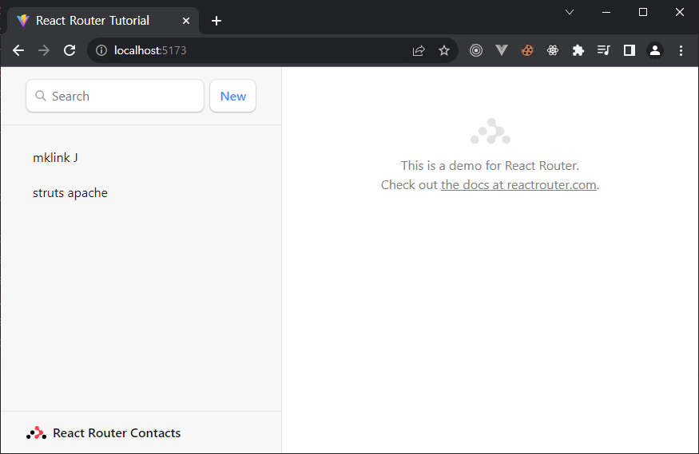

짜잔! 더 이상 빈 공간이 없습니다. 인덱스 경로에 대시보드, 통계, 피드 등을 배치하는 것이 일반적입니다. 그들은 데이터 로딩에도 참여할 수 있습니다.


## [Cancel 버튼](https://reactrouter.com/en/main/start/tutorial#cancel-button)

편집 페이지에는 아직 아무것도 하지 않는 cancel 버튼이 있습니다. 우리는 그것이 브라우저의 뒤로가기 버튼과 같은 일을 하기를 원합니다.

버튼에 대한 클릭 핸들러와 React Router의 [`useNavigate`](https://reactrouter.com/en/main/hooks/use-navigate)가 필요합니다.

👉 `useNavigate`를 사용하여 cancel 버튼 클릭 핸들러 추가

* `src/routes/edit.jsx`

  ```jsx
  import {
    Form,
    useLoaderData,
    redirect,
    useNavigate,
  } from "react-router-dom";
  
  export default function EditContact() {
    const { contact } = useLoaderData();
    const navigate = useNavigate();
  
    return (
      <Form method="post" id="contact-form">
        {/* existing code */}
  
        <p>
          <button type="submit">Save</button>
          <button
            type="button"
            onClick={() => {
              navigate(-1);
            }}
          >
            Cancel
          </button>
        </p>
      </Form>
    );
  }
  ```

이제 사용자가 "Cancel"를 클릭하면 브라우저 히스토리에 있는 한 항목이 다시 전송됩니다.

> 🧐 버튼에 `event.preventDefault`가 없는 이유는 무엇인가요?

`<button type="button">`은 중복되는 것처럼 보이지만 버튼이 양식을 제출하지 못하도록 하는 HTML 방식입니다.

두 가지 기능이 더 남았습니다. 이제 막바지에 이르렀습니다!


## [URL 검색 파라미터와 GET 제출](https://reactrouter.com/en/main/start/tutorial#url-search-params-and-get-submissions)

지금까지의 모든 인터랙티브 UI는 URL을 변경하는 링크이거나 데이터를 액션에 게시하는 양식이었습니다. 검색 필드는 이 두 가지가 혼합되어 있다는 점에서 흥미롭습니다. 양식이지만 URL만 변경하고 데이터는 변경하지 않습니다.

지금은 React 라우터 `<Form>`이 아닌 일반 HTML `<from>`일 뿐입니다. 브라우저가 기본적으로 이 폼으로 무엇을 하는지 살펴봅시다:

👉 검색 필드에 이름을 입력하고 Enter 키를 누릅니다.

이제 브라우저의 URL에 쿼리가 [URLSearchParams](https://developer.mozilla.org/en-US/docs/Web/API/URLSearchParams)로 포함되어 있습니다:

```
http://localhost:5173/?q=mklink
```

검색 양식을 검토하면 다음과 같습니다:

* `src/routes/root.jsx`

  ```html
  <form id="search-form" role="search">
    <input
      id="q"
      aria-label="Search contacts"
      placeholder="Search"
      type="search"
      name="q"
    />
    <div id="search-spinner" aria-hidden hidden={true} />
    <div className="sr-only" aria-live="polite"></div>
  </form>
  ```

앞서 살펴본 것처럼 브라우저는 input 요소의 `name` 속성으로 폼을 직렬화할 수 있습니다. 이 input의 name은 `q`이므로 URL에 ?q=가 있습니다. `search`이라고 이름을 지정하면 URL은 `?search=`가 됩니다.

이 양식은 지금까지 사용한 다른 양식과 다르며 `<form method="post">`가 없다는 점에 유의하세요. 기본 `method`는 `"get"`입니다. 즉, 브라우저가 다음 문서에 대한 요청을 생성할 때 양식 데이터를 요청 POST 본문에 넣지 않고 GET 요청의 [`URLSearchParams`](https://developer.mozilla.org/en-US/docs/Web/API/URLSearchParams)에 넣는다는 뜻입니다.


## 클라이언트 측 라우팅으로 GET 제출

클라이언트 측 라우팅을 사용하여 이 양식을 제출하고 기존 로더에서 목록을 필터링해 보겠습니다.

**👉 `<form>`을 `<Form>`으로 변경**

* `src/routes/root.jsx`

  ```jsx
  <Form id="search-form" role="search">
    <input
      id="q"
      aria-label="Search contacts"
      placeholder="Search"
      type="search"
      name="q"
    />
    <div id="search-spinner" aria-hidden hidden={true} />
    <div className="sr-only" aria-live="polite"></div>
  </Form>
  ```

**👉 URLSearchParams가 있는 경우 목록을 필터링합니다.**

* `src/routes/root.jsx`

  ```jsx
  export async function loader({ request }) {
    const url = new URL(request.url);
    const q = url.searchParams.get("q");
    const contacts = await getContacts(q);
    return { contacts };
  }
  ```

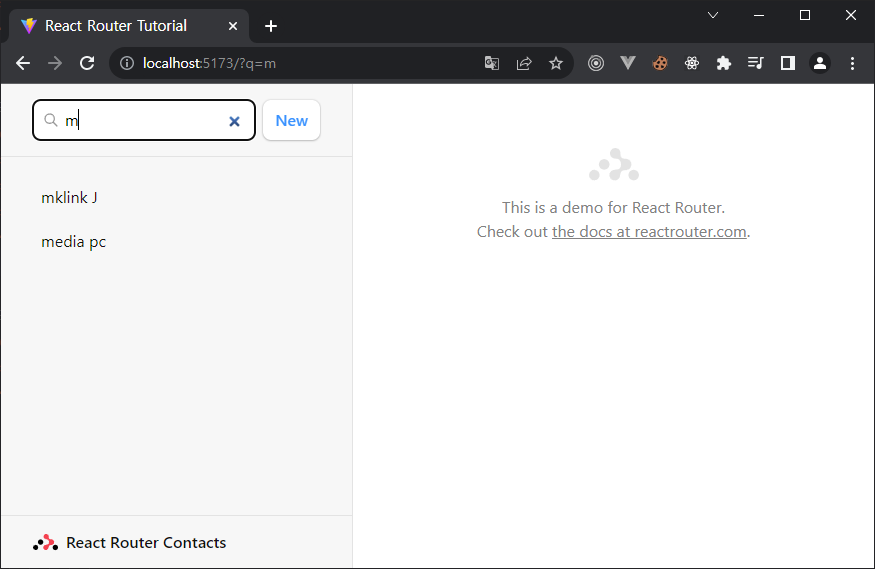

이것은 POST가 아닌 GET이기 때문에 React 라우터는 `action`을 호출하지 않습니다. GET 양식을 제출하는 것은 링크를 클릭하는 것과 동일하며 URL만 변경됩니다. 그렇기 때문에 필터링을 위해 추가한 코드는 이 경로의 `action`이 아니라 `loader`에 있습니다.

이는 정상적인 페이지 탐색이라는 의미이기도 합니다. 뒤로가기 버튼을 클릭하면 원래 위치로 돌아갈 수 있습니다.


---


## 기타

### async와 await

> `async`와 `await`는 자바스크립트의 비동기 처리 패턴 중 가장 최근에 나온 문법입니다. `async` 함수는 `await` 키워드가 함수 본문 내에서 허용되는 비동기 함수를 선언합니다. `async`와 `await` 키워드는 비동기적인, 프로미스 기반의 동작을 더 깔끔한 스타일로 작성할 수 있게 해주어 명시적으로 프로미스 체인을 구성할 필요가 없습니다.
>
> `async` 함수에는 `await` 식이 포함될 수 있습니다. 이 식은 `async` 함수의 실행을 일시 중지하고 전달 된 `Promise`의 해결을 기다린 다음 `async` 함수의 실행을 다시 시작하고 완료후 값을 반환합니다.