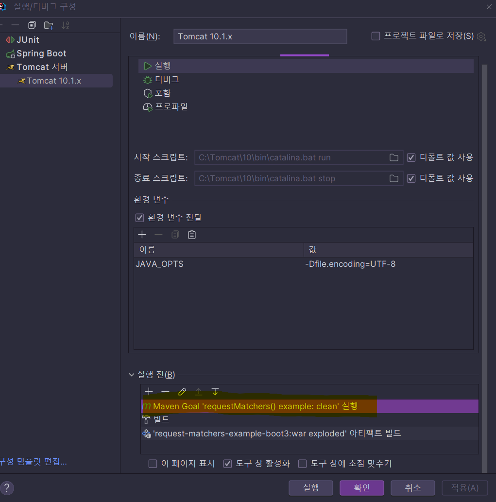

# 스프링 부트 3 예제 테스트


[requestMatchers-example](../requestMatchers-example) 프로젝트를 Spring Boot 3 (`3.1.5`) 로도 전환을 해보았다.

* ✨ `spring-boot:run`으로 실행해서 내장 Tomcat을 사용하면 문제가 없음
* 그런데...
  * 👺 war로 만들어서 Tomcat에 배포해서 실행할 때는 문제가 생김.
    * IntelliJ에서 Tomcat 연동해서 배포하면 mvn clean package 가 진행되면서 war파일 만들어지고 Tomcat에 반영되는 것 같음.
  * ✨ antMatcher()를 사용한 경우는 war 배포 후 실행해도 문제가 없음.

* ✨ Spring Security 6.1.1을 사용하는 Spring Boot 3.1.1에서는 문제가 없음


👺 Spring Boot 3.1.2 부터는 실행시 다음 예외가 발생함.

```
Caused by: org.springframework.beans.factory.BeanCreationException: Error creating bean with name 'securityFilterChain' defined in class path resource [org/mklinkj/qna/spring_security/security/HelloSecurityConfig.class]: Failed to instantiate [org.springframework.security.web.SecurityFilterChain]: Factory method 'securityFilterChain' threw exception with message: This method cannot decide whether these patterns are Spring MVC patterns or not. If this endpoint is a Spring MVC endpoint, please use requestMatchers(MvcRequestMatcher); otherwise, please use requestMatchers(AntPathRequestMatcher).

This is because there is more than one mappable servlet in your servlet context: {org.apache.jasper.servlet.JspServlet=[*.jspx, *.jsp], org.springframework.web.servlet.DispatcherServlet=[/]}.
```


---

## 의견

그동안 Boot 프로젝트 같은 경우는 spring-boot:run이나 bootRun으로 내장 실행만 해와서 문제를 잘 몰랐던 것 같다. 😅


---

## 기타

#### 오류1) Caused by: java.lang.IllegalArgumentException: 이름이 [spring_web]인, 둘 이상의 fragment들이 발견되었습니다. 이는 상대적 순서배열에서 불허됩니다. 상세 정보는 서블릿 스펙 8.2.2 2c 장을 참조하십시오. 절대적 순서배열을 사용하는 것을 고려해 보십시오.

* 이런 오류가 나면 mvn clean을 했을 때 해결 되었다.

다음처럼 Tomcat을 실행할 때, 최초에 무조건 clean을 실행하도록 해도 좋을 것 같다.



---

