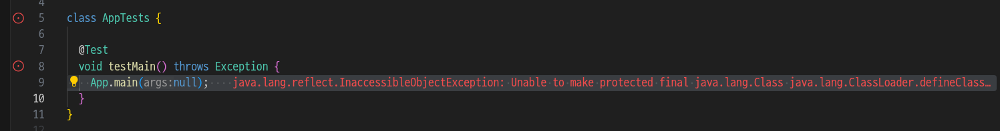
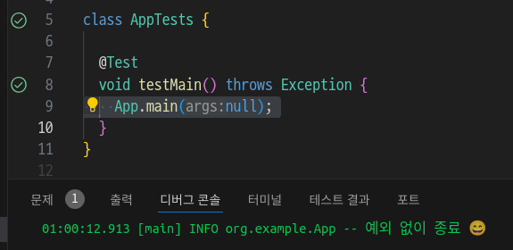

  

# Run 버튼으로 실행시 surefire 설정을 사용하지 않고 테스트 실행하는 현상


## 테스트 프로젝트 생성 - Maven

단순 아키 타입으로 만들어보자.

```
mvn archtype:generate
```


````
Choose archetype:
...
3: remote -> org.apache.maven.archetypes:maven-archetype-simple (An archetype which contains a simple Maven project.)
Choose a number or apply filter (format: [groupId:]artifactId, case sensitive contains): :
...
Define value for property 'groupId': org.example
Define value for property 'artifactId': surefire-test-example
Define value for property 'version' 1.0-SNAPSHOT: : 
Define value for property 'package' org.example: : 
Confirm properties configuration:
groupId: org.example
artifactId: surefire-test-example
version: 1.0-SNAPSHOT
package: org.example
 Y: : y
````

* 1.4 버전으로 선택
* 하위에 디렉토리가 또 생겨버렸는데...😅 적당이 맞추자!!
* Java 버전이나, 로깅, lombok 라이브러리 추가 등을 해줌


## 특정 vm 옵션이 없으면 예외를 발생하는 코드를 실행

```java
 public static void main(String[] args) throws Exception {
    try {
      Class<?> classLoaderClass = Class.forName("java.lang.ClassLoader");
      Method defineClassMethod =
          classLoaderClass.getDeclaredMethod(
              "defineClass", String.class, byte[].class, int.class, int.class);
      defineClassMethod.setAccessible(true); // 예외 발생 지점
      LOGGER.info("예외 없이 종료 😄");
    } catch (Exception e) {
      LOGGER.error("예외 발생 😭", e);
      throw e;
    }
  }
```

위의 코드는 java.lang.ClassLoader 클래스의 defineClass() 메서드에 접근하려고 시도하는데, 

defineClass() 메서드는 protected로 선언되어 있으므로, 일반적으로는 접근할 수 없다. 

하지만, setAccessible(true)를 호출하여 접근 제한을 해제하려고 하면, 

`java.base` 모듈이 `java.lang` 패키지를 unnamed module로서 열지 않았기 때문에 InaccessibleObjectException이 발생함.


## pom.xml에서의 surefire 플러그인 설정

```xml
  <build>
    <plugins>
      <plugin>
        <artifactId>maven-surefire-plugin</artifactId>
        <version>${maven-surefire-plugin.version}</version>
        <configuration>
          <argLine>
            --add-opens java.base/java.lang=ALL-UNNAMED
          </argLine>
        </configuration>
      </plugin>
    </plugins>
  </build>
```

`--add-opens java.base/java.lang=ALL-UNNAMED` 옵션을 추가해서 메이븐 테스트로 실행할 때, 예외를 해소함.

그러나 아래 처럼 vscode 내에서 테스트 Run 버튼으로 눌러서 실행하면 실패함.



* 아직 vscode-java-test 확장 프로그램이 Maven에 테스트를 위임하거나 surefire 플러그인 설정내용을 읽어오는 기능이 없음.


## java.test.config로 별도 설정

워크 스페이스 단위의 settings.json 파일에 별도 설정을 해줘야함.

```json
{
  "java.test.config": {
    "vmArgs": [
      "--add-opens=java.base/java.lang=ALL-UNNAMED"
    ]
  }
}
```

위의 설정을 해준 뒤에는 예외가 발생하지 않음을 알 수 있음.




## main 메서드의 Run 버튼으로 실행에 vm 옵션 적용 방법은?

launch.json 파일에 다음과 같이 만들어주면 잘 되었다.

```json
{
  "version": "0.2.0",
  "configurations": [
    {
      "type": "java",
      "name": "App",
      "request": "launch",
      "mainClass": "org.example.App",
      "projectName": "surefire-test-example",
      "vmArgs": [
        "--add-opens=java.base/java.lang=ALL-UNNAMED"
      ]
    }
  ]
}
```


---

이렇게 테스트 설정을 중복 지정해야하는 문제가 있는데,

개발자 분들이 인지하고 있어서, 나중에는 기능이 추가될 것 같다. 😄
