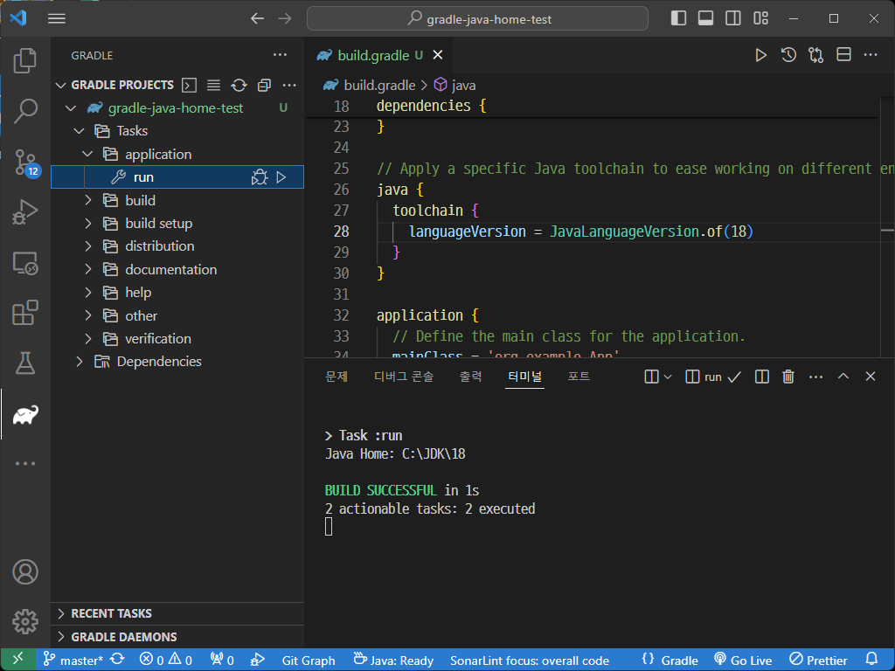

#### **한국어** | [English](README.md)

---

안녕하세요.

예제 테스트 프로젝트를 만들어서 동작을 확인해 보았는데...


coursework 프로젝트를 JDK 18로 사용하길 원하시면 다음과 같이 하시면 될 것 같습니다.

```json
{
    "java.configuration.runtimes": [
        { 
            "name": "JavaSE-18",  // 💡 Java 18을 설치해서 경로 추가
            "path": "/home/username/.jdks/openjdk-18",
        },
        {
            "name": "JavaSE-19",
            "path": "/home/username/.jdks/openjdk-19",
        },
        {
            "name": "JavaSE-20", // 💡 20으로 이름 바꿈.
            "path": "/home/username/.jdks/openjdk-20",
        },
        {
            "name": "JavaSE-22", // 💡 22로 이름 바꿈.
            "path": "/home/username/.jdks/openjdk-22",
            "default": true
        },
    ],

    // 💡 Gradle for Java를 구동하기 위한 Java Home의 경로
    "java.jdt.ls.java.home": "/home/username/.jdks/openjdk-19"

}
```


### TODO:

1. `java.configuration.runtimes`에 JavaSE 18 정보 입력.
2. 중복되어있는 `JavaSE-??` 이름 올바르게 수정.


`"java.jdt.ls.java.home"`는 단지 Gradle for Java 확장을 실행하기 위한 경로로서,  시스템에 전역적으로 JAVA_HOME이 설정되어있으면 특별히 명시하지 않아도 된 것 같긴합니다.


# 동작 테스트

### 예제 프로젝트

* https://github.com/mklinkj/QnA/tree/master/vscode-java/gradle-java-home-test

단순하게 현재 실행중인 Java Home을 출력하는 예제 프로그램입니다.


### 시스템 환경 상태

저의 경우는 gradle이 사용할 수 없는 JDK를 자동으로 다운로드 받지 않게하려고, 자동 다운로드를 금지 시켰고, JDK경로도 수동으로 지정한 상태입니다.

#### **%USERPROFILE%/.gradle/gradle.properties**

```properties
org.gradle.java.installations.auto-detect=false
org.gradle.java.installations.auto-download=false
org.gradle.java.installations.paths=C:/JDK/8,C:/JDK/11,C:/JDK/17,C:/JDK/18,C:/JDK/21
```


#### VSCode - User Settings.json

```json
    "java.configuration.runtimes": [
      {
        "name": "JavaSE-17",
        "path": "C:\\JDK\\17\\",
        "default": true
      },
      {
        "name": "JavaSE-21",
        "path": "C:\\JDK\\21\\"
      },
      {
        "name": "JavaSE-11",
        "path": "C:\\JDK\\11\\"
      },
		  {
        "name": "JavaSE-18",
        "path": "C:\\JDK\\18\\"
      },
      {
        "name": "JavaSE-1.8",
        "path": "C:\\JDK\\8\\"
      }
    ],
    // Gradle for Java를 실행하기 위한 Java 런타임 경로
    // Gradle for Java 설치 후 필요, 시스템에 JAVA_HOME 환경변수가 전역으로 설정되어 있다면 설정하지 않아도 된다.    
    "java.import.gradle.java.home": "C:\\JDK\\21",
```


#### 테스트 프로젝트의 Java Version 설정 - build.gradle

```groovy
// Apply a specific Java toolchain to ease working on different environments.
java {
  toolchain {
    languageVersion = JavaLanguageVersion.of(18)
  }
}
```


#### main() 메서드에 노출된 Run 링크를 눌러 실행

위와 같이 설정된 상태에서 테스트 프로젝트를 실행해보면...

```
C:\git-mklinkj\QnA\vscode-java\gradle-java-home-test> cmd /C "C:\JDK\18\bin\java.exe @%LOCALAPPDATA%\Temp\cp_bcmlni503byv5p5eyxxi4hqsu.argfile org.example.App "
Java Home: C:\JDK\18
```

* JDK 18로 잘 실행된 것을 확인할 수 있습니다.

  


#### Gradle for Java 의 application > run Task를 눌러서 실행

* JDK 18로 잘 동작하는 것을 확인했습니다.

  


## ⚠️ 주의 사항

* Gradle for Java의 application run Task로 실행하는 것이 아닌, 프로젝트 소스의 main() 메서드 위에 뜬 Run 링크로 실행시는 Java 버전을 전환뒤에는 반드시 Clean Java Langage Server Workspace를 해줘야함.

* **%USERPROFILE%/.gradle/gradle.properties** 파일을 수정한 경우에도 Clean Java Langage Server Workspace를 해줘야함.

* 프로젝트의 JDK 버전을 바꿀 때는 Clean Java Langage Server Workspace를 하는 것이 나음.

  


💡 뭔가 여러 버전의 JDK환경을 사용하는 개발 환경이라면 Gralde이 JDK를 자동으로 탐지하고, 다운로드 기능을 꺼두는것이 개인적인 생각으로는 나은 것 같더라구요... 😅

 

그럼 참고 부탁드립니다. 좋은하루되세요.


---

조금 더 보았을 때...

settings.json 에는 18버전이 선언 되어있지는 않지만,  전역 gradle.properties에 자동 다운로드 옵션이 켜져있으면, 18버전을 다운로드 받음.

1. 이때, Gradle for Java는 자동으로 다운로드 된 버전으로 프로그램을 실행함.
2. 그러나 main()에서 `Run` Link로 실행할 때는 settings.json에 선언된 Java 목록 중 18버전을 처리할 수 있는 Java 버전으로 실행됨.
   * 나의 경우는 JDK 21버전이 settings.json에 등록 되어있었기 때문에 21버전으로 실행되었음.


---

내가 몇가지 추측성 답변을 한 부분이 있는 것 같다. 😅

```json
    // Java Language Server를 시작하는 데 사용되는 JDK(17 이상)에 대한 폴더 경로를 지정합니다. 
    // 이 설정은 Java 확장의 내장 JRE를 대체하여 Java 언어 서버를 시작합니다.
    "java.jdt.ls.java.home": "C:\\JDK\\17",
    // Gradle 데몬을 실행하는 데 사용되는 JVM의 위치입니다.
    "java.import.gradle.java.home": "C:\\JDK\\17",
```

* `java.jdt.ls.java.home`를 설정하지 않으면 Java Language Server를 다음의 내장 JRE로 실행함.

  `%USERPROFILE%\.vscode\extensions\redhat.java-1.30.0-win32-x64\jre\17.0.10-win32-x86_64`

  * 💡그런데 이 값을 설정하지 않고 사용했을 때, Java 기본 클래스들의 자동완성이 정상 동작하지 않았던 적이 드물게 있었음.

* `java.import.gradle.java.home`는 Gradle For Java의 자체 실행보다는 Gradle For Java가 Gradle 데몬을 실행할 때 사용하는 Java 경로라는 의미가 정확한 것 같다.

