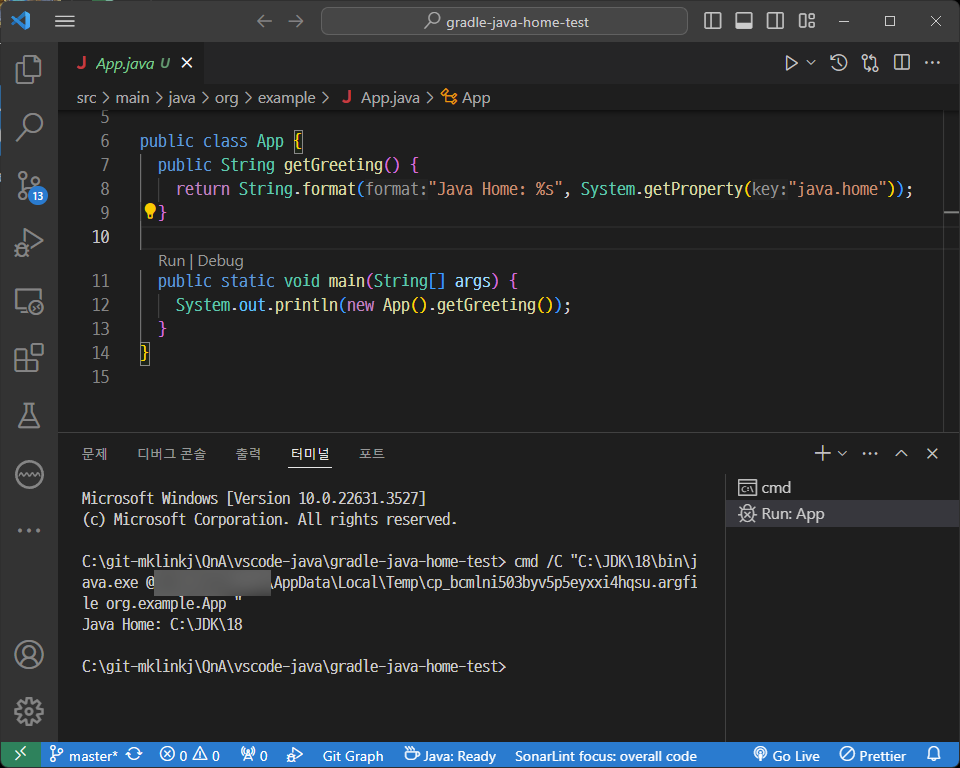

#### [한국어](README-ko.md) | **English**

---

hello.

I created an example test project and checked its operation...


If you want to use the coursework project with JDK 18, you can do it as follows.

```json
{
    "java.configuration.runtimes": [
			  { 
            "name": "JavaSE-18",  // 💡Install Java 18 on the system and add the path
            "path": "/home/username/.jdks/openjdk-18",
        },
        {
            "name": "JavaSE-19",
            "path": "/home/username/.jdks/openjdk-19",
        },
        {
            "name": "JavaSE-20", // 💡Renamed to JavaSE-20.
            "path": "/home/username/.jdks/openjdk-20",
        },
        {
            "name": "JavaSE-22", // 💡Renamed to JavaSE-22.
            "path": "/home/username/.jdks/openjdk-22",
            "default": true
        },
    ],

    // 💡 Path to Java Home to run Gradle for Java
    "java.jdt.ls.java.home": "/home/username/.jdks/openjdk-19"

}
```


### TODO:

1. Add JavaSE 18 installation path to `java.configuration.runtimes`.
2. Correctly corrected duplicate `JavaSE-??` name.


`"java.jdt.ls.java.home"` is simply the path to run the Gradle for Java extension, and if JAVA_HOME is set globally on the system, it does not seem to need to be specifically specified.


# Example Test

### Example Project

* https://github.com/mklinkj/QnA/tree/master/vscode-java/gradle-java-home-test

This is a simple example program that prints the currently running Java Home.


### System environment

In my case, to prevent gradle from automatically downloading a JDK that cannot be used, I disabled automatic downloading and manually specified the JDK path.

#### **%USERPROFILE%/.gradle/gradle.properties**

```properties
org.gradle.java.installations.auto-detect=false
org.gradle.java.installations.auto-download=false
org.gradle.java.installations.paths=C:/JDK/8,C:/JDK/11,C:/JDK/17,C:/JDK/18,C:/JDK/21
```


#### VSCode - User Settings.json

```json
    "java.configuration.runtimes": [
      {
        "name": "JavaSE-17",
        "path": "C:\\JDK\\17\\",
        "default": true
      },
      {
        "name": "JavaSE-21",
        "path": "C:\\JDK\\21\\"
      },
      {
        "name": "JavaSE-11",
        "path": "C:\\JDK\\11\\"
      },
		  {
        "name": "JavaSE-18",
        "path": "C:\\JDK\\18\\"
      },
      {
        "name": "JavaSE-1.8",
        "path": "C:\\JDK\\8\\"
      }
    ],
    // Java runtime path to run Gradle for Java
    // Required after installing "Gradle for Java". If the JAVA_HOME environment variable is set globally on the system, it does not need to be set.
    "java.import.gradle.java.home": "C:\\JDK\\21",
```


#### Java Version settings for example project - build.gradle

```groovy
// Apply a specific Java toolchain to ease working on different environments.
java {
  toolchain {
    languageVersion = JavaLanguageVersion.of(18)
  }
}
```


#### Run it by clicking the Run link that appears above the main() method.

If you run the test project with the settings as above...

```
C:\git-mklinkj\QnA\vscode-java\gradle-java-home-test> cmd /C "C:\JDK\18\bin\java.exe @%LOCALAPPDATA%\Temp\cp_bcmlni503byv5p5eyxxi4hqsu.argfile org.example.App "
Java Home: C:\JDK\18
```

* I confirmed that it works well with JDK 18.

  


#### Run it by clicking application > run Task in “Gradle for Java”

* I confirmed that it works well with JDK 18.

  


## ⚠️ Caution

* When changing the JDK version of a project, it is better to use Clean Java Language Server Workspace.

  

💡 If you have a development environment that uses multiple versions of the JDK environment, I personally think it would be better to disable Gralde's automatic JDK detection function and automatic download function... 😅


Then, please take note of this. Have a great day.


---

Upon further inspection…

Even though version 18 is not declared in settings.json, if the automatic download option is turned on in the global gradle.properties, it will download version 18.

At this point, Gradle for Java  runs the program with the downloaded automatically version.
However, when running from the Run Link in main(), it runs with a Java version from the Java list declared in settings.json that can handle version 18.
In my case, because JDK version 21 was registered in settings.json, it ran with version 21.